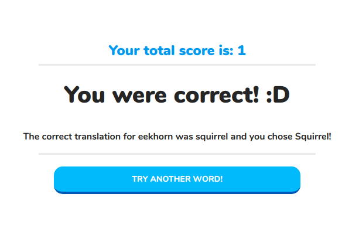

# Spaced Repetition

Alexander Reich and Chris Carnivale
 
[Live App](https://ac-spaced-repetition.now.sh/)
[Server Repo](https://github.com/thinkful-ei-armadillo/spaced-repetition-alex-chris-server)

## Summary
Learn a new language through the spaced repetition technique.  This is a DuoLingo clone that utilizes basic data structures and a responsive front end designed in React. Back-end supports multiple languages but only comes pre-seeded with 11 Dutch words.

Project was completed to provided test specifications and built off of a provided project base.

## Pages

#### Registration Page


Re-directed to the registration page if you are not logged in
Requires a name, username and password
Communicates with `post api/user` endpoint for verification

#### Log-In Page

Can navigate to the login page when not logged in
Can navigate back to registration page
If token is invalid, automatically re-directs back to this page
Communicates with `post api/auth/token` and `put api/auth`

#### Dashboard Page

As a logged in user, communicates with `get api/language`, shows the current 
language for that user, and the words to learn for that language
Also shows the scores for all words and the total score
Users are given a button to start learning

#### Learning Page

As a logged in user, communicates with `get api/language/head` to get first word
Shows the word and asks for translation
Communicates with `post api/language/guess` to confirm translation and to get the
next word to learn

#### Correct/Incorrect Page


Shows details of the response from `post api/language/guess`
Provides button for user to move on to the next word

## Technology
- React
  - Context
- HTML5
- CSS3
- Cypress 

## Setup

To setup the application

1. Fork and clone the project to your machine
2. `npm install`. This will also install the application *Cypress.io* for running browser integration tests

The project expects you have the Spaced repetition API project setup and running on http://localhost:8000.

Find instructions to setup the API here https://github.com/thinkful-ei-armadillo/spaced-repetition-alex-chris-server.

## Running project

This is a `create-react-app` project so `npm start` will start the project in development mode with hot reloading by default.

## Running the tests

This project uses [Cypress IO](https://docs.cypress.io) for integration testing using the Chrome browser.

Cypress has the following expectations:

- You have cypress installed (this is a devDependency of the project)
- You have your application running at http://localhost:3000.
  - You can change the address of this expectation in the `./cypress.json` file.
- Your `./src/config.js` is using http://localhost:8000/api as the `API_ENDPOINT`

To start the tests run the command:

```bash
npm run cypress:open
```

On the first run of this command, the cypress application will verify its install. Any other runs after this, the verification will be skipped.

The command will open up the Cypress application which reads tests from the `./cypress/integration/` directory. You can then run individual tests by clicking on the file names or run all tests by clicking the "run all tests" button in the cypress GUI.

Tests will assert against your running localhost client application.

You can also start all of the tests in the command line only (not using the GUI) by running the command:

```bash
npm run cypress:run
```

This will save video recordings of the test runs in the directory `./cypress/videos/`.
